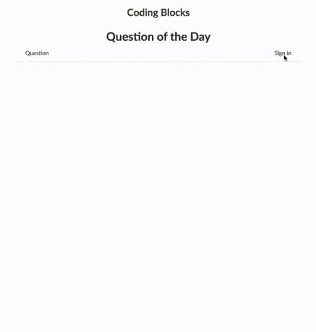

# CodingBlocks - CodeQuiz Web Admin Console

This webapp is the admin console of the Coding Blocks' CodeQuiz platform. 

## Purpose

The CodeQuiz&trade; platform will power multiple web and mobile apps. It is 
fundamentally a repository of multiple-choice questions (MCQ) on topics related
to **coding**, **programming**, and **computer languages**. 

## Features

Right now, there are two collections - 

* **Users** - List of users, with roles like _Administrator_ granted to some
* **Questions** - List of all questions.

The question object looks a bit like this

```javascript
{
  question: "What is C++?",
  options:
    [
      {option: "A programming language", correct: true},
      {option: "A scientific language", correct: false},
      {option: "A language extended from C", correct: true},
      {option: "A dynamically typed language"} //The correct field might not exist 
    ],
  tags: {"cpp", "languages"}
  author: {...} // Pointer to user object
  
}
```


## Demo


[Click here](https://cbqotd.herokuapp.com) to see demo hosted on Heroku

## Prerequisites

You will need the following things properly installed on your computer.

* [Git](http://git-scm.com/)
* [Node.js](http://nodejs.org/) (with NPM)
* [Bower](http://bower.io/)
* [Ember CLI](http://ember-cli.com/)
* [PhantomJS](http://phantomjs.org/) _(only for testing)_

You'd also need a *[Parse](http://parseplatform.github.io)* installation, 
either on your local machine, or remote (You can use Parse hosting services
such as <http://back4app.com>. 


## Installation

* `git clone <repository-url>` this repository
* `cd cbqotd`
* `npm install`
* `bower install`

## Running / Development

* `ember serve`
* Visit your app at [http://localhost:4200](http://localhost:4200).

### Code Generators

Make use of the many generators for code, try `ember help generate` for more details

### Running Tests

* `ember test`
* `ember test --server`

### Building

* `ember build` (development)
* `ember build --environment production` (production)

### Deploying

You can just perform `ember build` and statically host the `dist` folder on a 
static web host. Or you can host it on any server that supports _**Node.JS**_.
The `npm start` command is already configured to run a livereload server.

## Further Reading / Useful Links

* [ember.js](http://emberjs.com/)
* [ember-cli](http://ember-cli.com/)
* Development Browser Extensions
  * [ember inspector for chrome](https://chrome.google.com/webstore/detail/ember-inspector/bmdblncegkenkacieihfhpjfppoconhi)
  * [ember inspector for firefox](https://addons.mozilla.org/en-US/firefox/addon/ember-inspector/)

